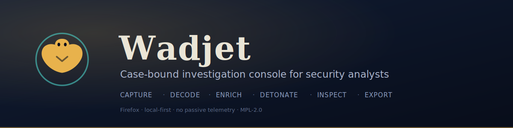

# Wadjet

<p align="center">
  
</p>

A Firefox WebExtension that turns the browser into a **case-bound investigation
console** for security analysts. Everything an analyst touches during an
analysis — requests, decoded payloads, enrichment verdicts, screenshots, notes —
is automatically bound to a **case**, timestamped, and (in later waves)
exportable as a report. The goal is to stop context fragmentation during an
investigation.

Wadjet is **not** a proxy, **not** a scanner, and **not** a threat-intel
product. It integrates with the tools an analyst already uses; it does not
reimplement them. See [Non-goals](#non-goals).

> Named after Wadjet, the Egyptian cobra goddess of protection, and the _wedjat_
> (Eye of Horus).

## Status

**v1.1.0.** Adds the project's visual identity — the _uraeus_ mark (with a
compact build for small sizes) and the README banner — on top of the hardened
**v1.0.0** first release: a permission audit, a documented
[threat model](THREAT_MODEL.md), a security-review pass, a reviewed AMO
data-collection declaration, and an automated signing/submission step in CI.

What Wadjet does: bind everything an analyst touches to a **case** — captured
requests (redacted), inline **codec** conversions, on-demand **enrichment**,
isolated **detonation**, per-page **DevTools** analysis — then **export** it
(Markdown / HAR / CSV / JSON) or archive it via the optional **native host**.

Delivered across waves v0.1.0–v0.9.0; see [`CHANGELOG.md`](CHANGELOG.md).

## Requirements

- **Firefox** desktop, current ESR or stable (`strict_min_version` 128.0).
- **Node.js** 20+ and npm (for building from source).

## Getting started

```sh
npm install        # install dev dependencies
npm run build      # bundle the extension into dist/
npm run ext:run    # launch a temporary Firefox with the extension loaded
```

The sidebar (Wadjet's current-case surface) opens from the Firefox sidebar
button, or via **View → Sidebar → Wadjet**.

### Development scripts

| Script                | Purpose                                            |
| --------------------- | -------------------------------------------------- |
| `npm run build`       | One-off production bundle into `dist/`.            |
| `npm run build:watch` | Rebuild on change (inline sourcemaps, unminified). |
| `npm run typecheck`   | `tsc --noEmit` in strict mode.                     |
| `npm run lint`        | ESLint (type-aware).                               |
| `npm run format`      | Prettier check.                                    |
| `npm test`            | Vitest unit tests.                                 |
| `npm run ext:lint`    | `web-ext lint` (AMO validation) against `dist/`.   |
| `npm run check`       | Everything above, in sequence — the pre-PR gate.   |

## Architecture

The extension has two runtime contexts today:

- **Background coordinator** (`src/background/`) — owns the single source of
  truth for the case model (the `CaseService`) and answers typed messages. It is
  the only context that mutates persisted data.
- **Sidebar** (`src/sidebar/`) — a thin view over the typed message protocol;
  presentation and wiring only.

The background context also runs the non-blocking `webRequest` listeners that
feed traffic capture, hosts the decode / enrich / detonate context menus, makes
provider network calls, and manages throwaway detonation containers; the sidebar
drives the capture toggle, the host-permission prompts, provider keys,
enrichment lookups, and detonation. An overlay content script (`src/content/`)
is injected on demand for inline decoding.

Shared domain logic lives in `src/core/`:

- `core/case/` — the case model: types, schema/version guards, and the service.
- `core/storage/` — a hybrid persistence layer: `browser.storage.local` for
  case metadata, IndexedDB for the entry stream and content-addressed blobs.
- `core/traffic/` — request correlation (assembling `webRequest` events into one
  record) and sensitive-header redaction, both pure and unit-tested.
- `core/decode/` — deterministic decoders (base64, URL, hex, unicode, JWT) and
  rule-based encoding detection, both pure and unit-tested.
- `core/enrich/` — indicator classification, the provider registry, a
  token-bucket rate limiter, a TTL cache, and the enrichment orchestrator (all
  injectable and unit-tested; the HTTP call is the only glue).
- `core/settings/` — extension settings, including per-provider API keys.
- `core/export/` — IOC extraction and the Markdown / HAR / CSV / JSON export
  builders, all pure and unit-tested.
- `core/analysis/` — the deterministic security-header analyzer and the TLS-info
  shape used by the DevTools panel.
- `core/native/` — the native-messaging protocol types shared with the host.
- `core/messaging/` — the typed request/response protocol and client.

A DevTools page and panel (`src/devtools/`) provide per-page analysis; the
background collects TLS info via `webRequest.getSecurityInfo`. The optional
Python native host lives in [`native-host/`](native-host/).

Persisted records carry a `schemaVersion`, so the on-disk shape can evolve
across waves through explicit migrations rather than guesswork.

## Permissions

Wadjet requests the **minimum viable** permissions at every wave; each is
justified here and in the PR that introduced it.

| Permission                | Since  | Why                                                                                                                  |
| ------------------------- | ------ | -------------------------------------------------------------------------------------------------------------------- |
| `storage`                 | v0.1.0 | Persist the case list and the active-case pointer locally.                                                           |
| `webRequest`              | v0.2.0 | Observe request metadata and headers for traffic capture (non-blocking; never intercepting).                         |
| `webRequestBlocking`      | v0.7.0 | Required by `getSecurityInfo` to read TLS/certificate info; the listener observes only and never blocks or modifies. |
| `<all_urls>` (optional)   | v0.2.0 | Host access to capture across sites. **Optional** — requested only when you start capture.                           |
| `menus`                   | v0.3.0 | Add the "Decode selection" context-menu item.                                                                        |
| `activeTab`               | v0.3.0 | Access the current tab to inject the decoder overlay, granted by the menu click.                                     |
| `scripting`               | v0.3.0 | Inject the decoder overlay content script on demand.                                                                 |
| provider hosts (optional) | v0.4.0 | Reach a provider's API for enrichment. **Optional** — each host is requested only when you save that provider's key. |
| `contextualIdentities`    | v0.5.0 | Create and remove throwaway containers for isolated detonation.                                                      |
| `cookies`                 | v0.5.0 | Support clean-up of a throwaway container's cookies.                                                                 |
| `downloads`               | v0.6.0 | Save an exported report/HAR/CSV/JSON file to disk.                                                                   |
| `nativeMessaging`         | v0.8.0 | Talk to the optional `wadjet_host` native helper (archive, evidence, tools). Inert if the host is not installed.     |

Enrichment is the **only** feature that sends anything off the machine: when you
enrich an indicator, that indicator is sent to the provider whose key you
configured (and nowhere else). Nothing is transmitted passively, and no
telemetry is collected. Everything else stays local — case entries and binary
evidence live in IndexedDB, captured traffic never leaves the browser, and
sensitive headers are redacted before storage.

Data-collection declaration: Wadjet requires **no** data collection
(`data_collection_permissions.required: ["none"]`) — it runs no telemetry. Because
enrichment forwards a user-supplied indicator to a third-party provider on
explicit action, that egress is declared as **optional** data collection
(`optional: ["websiteActivity"]`), so Firefox asks for consent when the feature
is used. See the [threat model](THREAT_MODEL.md).

## Non-goals

Wadjet will not become any of the following, by design:

- A proxy or interception engine (integrate with Burp/mitmproxy instead).
- A vulnerability scanner or any active testing capability.
- A browser fingerprint spoofing / anti-detection tool.
- An ML/statistical classifier of phishing or malware. (Deterministic,
  individually explainable signals are a _post-1.0_ candidate.)
- A fork of Firefox.

## License

[MPL-2.0](LICENSE).
